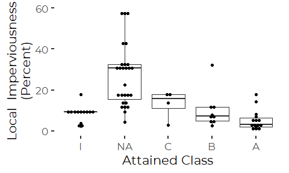
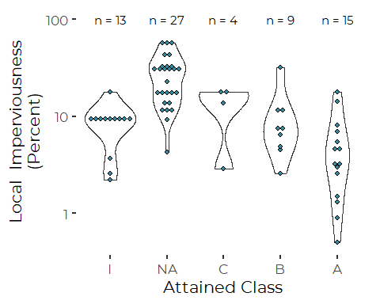
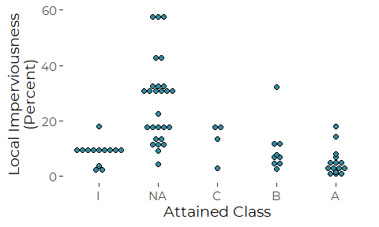
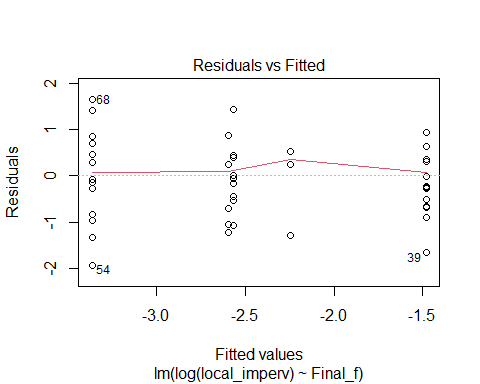
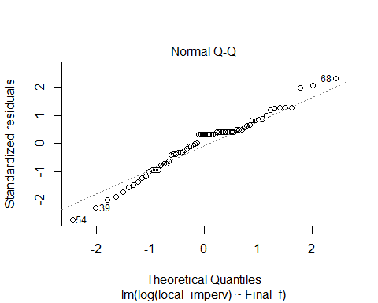

Attained Stream Class Related to Impervious Cover
================
Curtis C. Bohlen, Casco Bay Estuary Partnership
12/19/2020

  - [Introduction](#introduction)
  - [Load Libraries](#load-libraries)
  - [Load Data](#load-data)
      - [Establish Folder References](#establish-folder-references)
      - [Read the Data](#read-the-data)
          - [Recent Sample Data](#recent-sample-data)
  - [Preliminary Plots](#preliminary-plots)
  - [Violin Plot](#violin-plot)
  - [Dot Plots](#dot-plots)
  - [Make Table](#make-table)
  - [Direct Modelling](#direct-modelling)


# Introduction

Maine DEP has developed a robust stream classification model that is
based on collecting stream invertebrates from “rock baskets” left in
streams for about a month. They have also developed methods to assess
water quality based on comments of the algae community.

In this Notebook, we focus on generating a plot that emphasizes the
connection between water quality and land use.

Our principal data is a letter grade (‘A’, ‘B’, ‘C’, ‘NA’) assigned to
each site based on biomonitoring data. Our data on imperviousness is
based only on LOCAL imperviousness (in the local catchment) not on total
upstream IC.

# Load Libraries

``` r
library(tidyverse)
#> -- Attaching packages --------------------------------------- tidyverse 1.3.0 --
#> v ggplot2 3.3.2     v purrr   0.3.4
#> v tibble  3.0.4     v dplyr   1.0.2
#> v tidyr   1.1.2     v stringr 1.4.0
#> v readr   1.4.0     v forcats 0.5.0
#> -- Conflicts ------------------------------------------ tidyverse_conflicts() --
#> x dplyr::filter() masks stats::filter()
#> x dplyr::lag()    masks stats::lag()
library(emmeans)
library(mblm)

library(CBEPgraphics)
load_cbep_fonts()
theme_set(theme_cbep())
```

# Load Data

## Establish Folder References

``` r
sibfldnm <- 'Derived_Data'
parent   <- dirname(getwd())
sibling  <- file.path(parent,sibfldnm)

dir.create(file.path(getwd(), 'figures'), showWarnings = FALSE)
```

DEP uses “NA” to indicate “Non Attainment” in the data. By default, R
interprets that as `NA`, meaning missing data. We need to address that
in our code. We also need to be careful in later analyses that R does
not drop that value. We considered changing the data label, but DEP uses
“NA” consistently, and for simplicity of communications it is easiest if
we retain the original designation.

**Note that imported data contains invertebrate, wetland, and algae
sample data, including sometimes sharing the same site designations.**

## Read the Data

### Recent Sample Data

``` r
fn <- "Recent_Stream_Biomonitoring.csv"
the_data <- read_csv(file.path(sibling, fn), na = '') %>%
  mutate(Date = as.Date(Date, format = '%m/%d/%Y'),
         Year = as.integer(format(Date, format = '%Y'))) %>%
  relocate(Year, .after = Date) %>%
  relocate(Attained, .after = Final) %>%
  mutate(Final_o = ordered(Final, levels = c('NA', 'C', 'B', 'A'))) %>%
  mutate(Final_f = factor(Final, levels = c('I', 'NA', 'C', 'B', 'A'))) %>%
  relocate(c(Final_f, Final_o), .after = Final)
#> 
#> -- Column specification --------------------------------------------------------
#> cols(
#>   Station = col_character(),
#>   Type = col_character(),
#>   Date = col_date(format = ""),
#>   Statutory = col_character(),
#>   Final = col_character(),
#>   Attained = col_character(),
#>   Year = col_double(),
#>   Final_f = col_character(),
#>   local_imperv = col_double()
#> )
```

# Preliminary Plots

``` r
plt <- ggplot(the_data, aes(x = Final_f, y = local_imperv * 100)) +
  geom_boxplot() +
  ylab('Local  Imperviousness\n(Percent)') +
  xlab('Attained Class')
plt
```


``` r
plt + 
  geom_dotplot(binaxis='y', stackdir='center', binwidth = 1,
               stackratio=1, dotsize=1.5)
```



The following is better, addressing heteroskedasticity, but it may be
hard to explain to readers, and it obscures how few samples we have in a
few of the groups.

``` r
plt + 
stat_summary(fun=mean, geom="point", shape=18,
                 size=3, color="red") +
  scale_y_log10()
```


``` r
n_fun <- function(x){
  return(data.frame(y = 65, label = paste0("n = ",length(x))))
}
plt +
  stat_summary(fun.data = n_fun, geom = "text")
```


# Violin Plot

``` r
plt <- ggplot(the_data, aes(x = Final_f, y = local_imperv * 100)) +
  geom_violin() +
  #stat_summary(fun=median, geom="point", shape=18,
  #               size=3, color="red") +
  ylab('Local  Imperviousness\n(Percent)') +
  xlab('Attained Class') +
  scale_y_log10()
plt
```


``` r
n_fun <- function(x){
  return(data.frame(y = 2, label = paste0("n = ",length(x))))
}
  
plt +
  stat_summary(fun.data = n_fun, geom = "text") +
  geom_dotplot(binaxis='y', stackdir='center', binwidth = .025,
               stackratio=1, dotsize=2,
               fill = cbep_colors()[5])
```



# Dot Plots

``` r
n_fun <- function(x){
  return(data.frame(y = 1.9, label = paste0("n = ",length(x))))
}

plt <- ggplot(the_data, aes(x = Final_f, y = local_imperv * 100)) +
  #stat_summary(fun.data = n_fun, geom = "text") +
  geom_dotplot(binaxis='y', stackdir='center', binwidth = .05,
               stackratio=1, dotsize=2,
               fill = cbep_colors()[5]) +

  ylab('Local  Imperviousness\n(Percent)') +
  xlab('Attained Class') +
  scale_y_log10()

plt
```


``` r
plt <- ggplot(the_data, aes(x = Final_f, y = local_imperv * 100)) +
  
  geom_dotplot(binaxis='y', stackdir='center', binwidth = 1,
               stackratio=1, dotsize=2,
               fill = cbep_colors()[5]) +

  ylab('Local Imperviousness\n(Percent)') +
  xlab('Attained Class') +
  
  theme_cbep(base_size = 14)

plt
```



``` r
ggsave('figures/class_and_imperviousness_dots.pdf', device=cairo_pdf, width = 5, height = 3)
```

``` r
n_fun <- function(x){
  return(data.frame(y = 65, label = paste0("n = ",length(x))))
}
plt +
  stat_summary(fun.data = n_fun, geom = "text", size = 4)
```


``` r
ggsave('figures/class_and_imperviousness_dots_w_sample.pdf', device=cairo_pdf, width = 5, height = 3)
```

# Make Table

An alternative is to provide results in a table.

``` r
the_data %>%
  group_by(fct_rev(Final_f)) %>%
  summarize(avg = mean(local_imperv * 100) ,
            med = median(local_imperv * 100),
            sample = n(),
            stdev = sd(local_imperv * 100) ,
            stderr = stdev/sqrt(sample),
            .groups = 'drop') %>%
  knitr::kable(digits = c(0,1,1,1,3,3),
               col.names = c('Attained Class', 'Mean',
                             'Median' , 'Sample', 'Std Dev', 'Std Err'),
               caption = 'Imperviousness by Attained Class' )
```

| Attained Class | Mean | Median | Sample | Std Dev | Std Err |
| :------------- | ---: | -----: | -----: | ------: | ------: |
| A              |  5.2 |    3.2 |     15 |   4.969 |   1.283 |
| B              |  9.9 |    7.3 |      9 |   8.874 |   2.958 |
| C              | 13.0 |   15.7 |      4 |   7.034 |   3.517 |
| NA             | 26.9 |   30.7 |     27 |  15.007 |   2.888 |
| I              |  8.5 |    9.4 |     13 |   4.012 |   1.113 |

Imperviousness by Attained Class

# Direct Modelling

A log transform addresses heteroskedasticity, and improves the model.

``` r
the_lm <- lm(log(local_imperv) ~ Final_f, data = the_data)
plot(the_lm)
```



``` r
anova(the_lm)
#> Analysis of Variance Table
#> 
#> Response: log(local_imperv)
#>           Df Sum Sq Mean Sq F value    Pr(>F)    
#> Final_f    4 36.971  9.2428  16.875 1.885e-09 ***
#> Residuals 63 34.506  0.5477                      
#> ---
#> Signif. codes:  0 '***' 0.001 '**' 0.01 '*' 0.05 '.' 0.1 ' ' 1
summary(the_lm)
#> 
#> Call:
#> lm(formula = log(local_imperv) ~ Final_f, data = the_data)
#> 
#> Residuals:
#>     Min      1Q  Median      3Q     Max 
#> -1.9324 -0.4648  0.2328  0.3598  1.6455 
#> 
#> Coefficients:
#>             Estimate Std. Error t value Pr(>|t|)    
#> (Intercept) -2.59721    0.20526 -12.653  < 2e-16 ***
#> Final_fNA    1.11655    0.24984   4.469 3.34e-05 ***
#> Final_fC     0.35033    0.42316   0.828  0.41085    
#> Final_fB     0.02954    0.32092   0.092  0.92696    
#> Final_fA    -0.76866    0.28044  -2.741  0.00796 ** 
#> ---
#> Signif. codes:  0 '***' 0.001 '**' 0.01 '*' 0.05 '.' 0.1 ' ' 1
#> 
#> Residual standard error: 0.7401 on 63 degrees of freedom
#> Multiple R-squared:  0.5172, Adjusted R-squared:  0.4866 
#> F-statistic: 16.88 on 4 and 63 DF,  p-value: 1.885e-09
```

So, both ‘NA’ and ‘A’ are different from the reference level (here,
‘I’). We need to turn to EMMEANS or use another pairwise procedure,
to determine other comparisons.

``` r
(emm <- emmeans(the_lm, 'Final_f', type = 'response'))
#>  Final_f response     SE df lower.CL upper.CL
#>  I         0.0745 0.0153 63   0.0494   0.1122
#>  NA        0.2275 0.0324 63   0.1711   0.3024
#>  C         0.1057 0.0391 63   0.0505   0.2215
#>  B         0.0767 0.0189 63   0.0469   0.1256
#>  A         0.0345 0.0066 63   0.0236   0.0506
#> 
#> Confidence level used: 0.95 
#> Intervals are back-transformed from the log scale
```

``` r
pwpp(emm)
```


So, pairwise comparisons A, B, and I show distributions of IC different
from NA. A is NEARLY different from I, B, and C.
